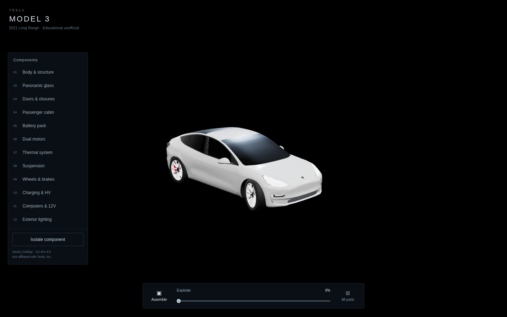
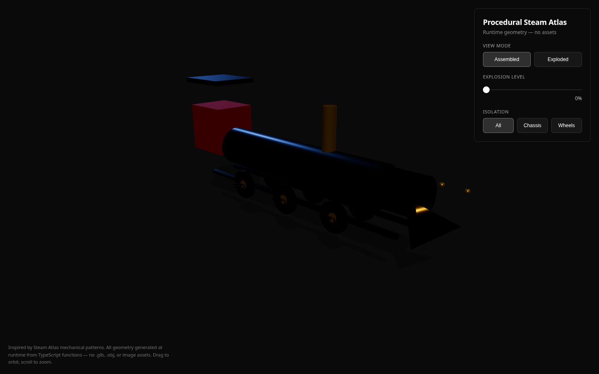
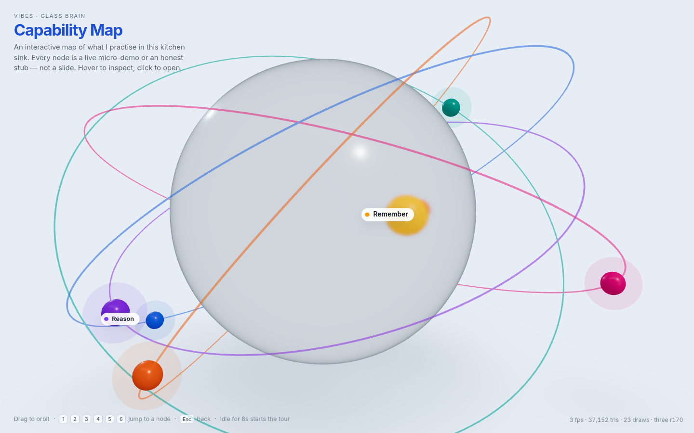
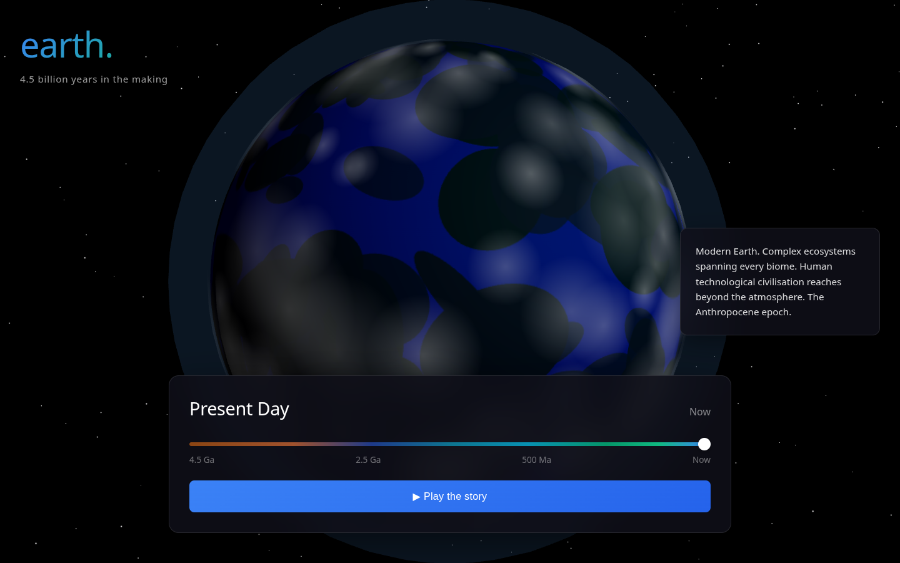
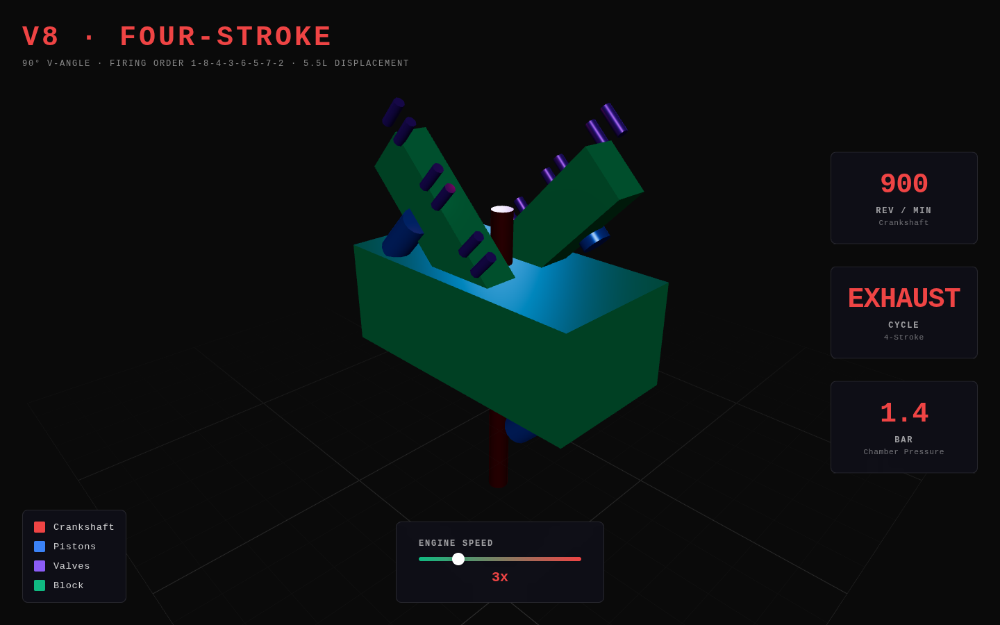
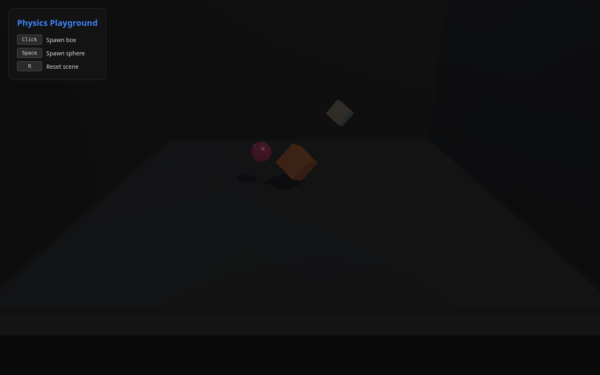
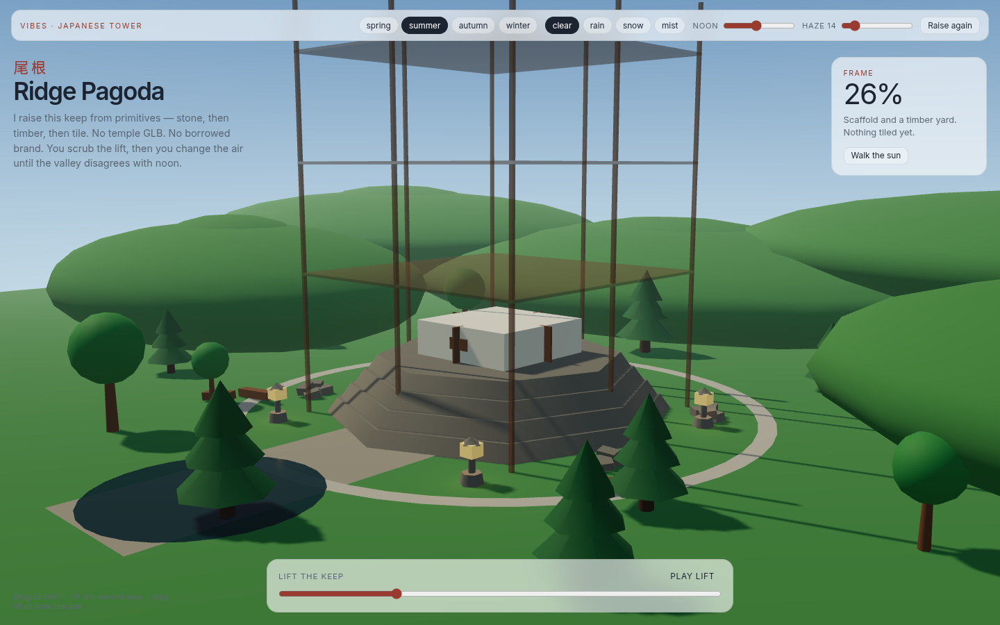
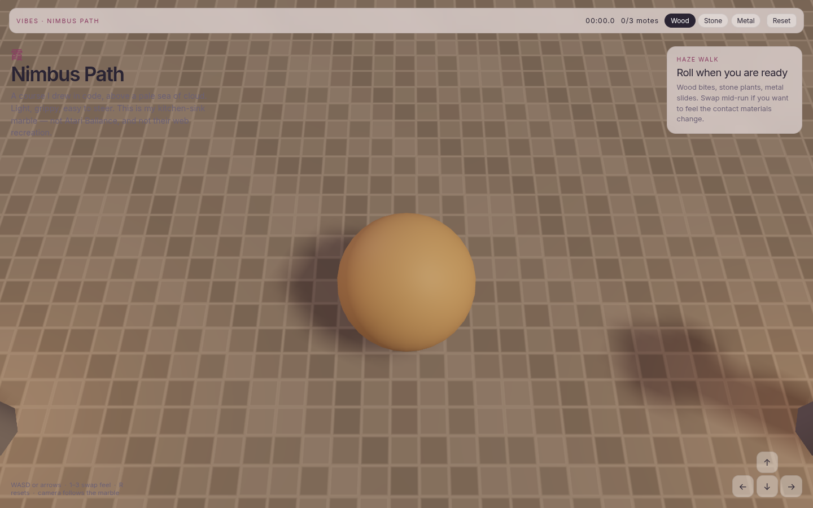
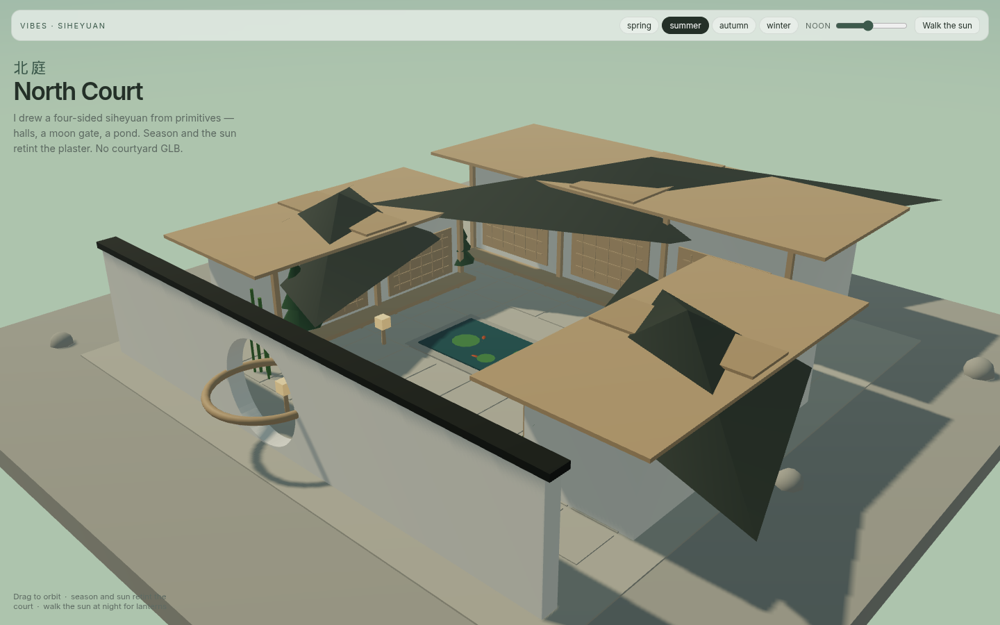

# vibes

Kitchen-sink **AI 3D experiments** — interactive WebGL demos, procedural geometry, and clean-room studies of public patterns. Research and education only. Not production software.

Each app is a self-contained Vite experiment under [`experiments/`](./experiments/).

**Contents:** [Apps](#apps) · [Quick start](#quick-start) · [Deployment](#deployment) · [Docs](#docs) · [Disclaimer](#disclaimer) · [Licence](#licence)

## Apps

Preview stills live in [`docs/previews/`](./docs/previews/). Hill-climb / visual QA should refresh `docs/previews/<app>.png` when an app ships or redeploys — see [preview refresh](./docs/visual-qa/README.md). Semicircle has no hero shot: production is still the cropped mega-arc.

| Preview | App | README | Live | Status | Run |
| :---: | --- | --- | --- | --- | --- |
|  | [explode-assembly](./experiments/explode-assembly/README.md) | [README](./experiments/explode-assembly/README.md) | [live](https://vibes-explode.vercel.app) | **PASS** | `cd experiments/explode-assembly && npm i && npm run dev` |
|  | [procedural-steam-atlas](./experiments/procedural-steam-atlas/README.md) | [README](./experiments/procedural-steam-atlas/README.md) | [live](https://vibes-steam-atlas.vercel.app) | **PASS** | `cd experiments/procedural-steam-atlas && npm i && npm run dev` |
|  | [glass-capability-brain](./experiments/glass-capability-brain/README.md) | [README](./experiments/glass-capability-brain/README.md) | [live](https://vibes-glass-capability-brain.vercel.app) | **PASS** | `cd experiments/glass-capability-brain && npm i && npm run dev` |
|  | [earth-timeline](./experiments/earth-timeline/README.md) | [README](./experiments/earth-timeline/README.md) | [live](https://vibes-earth.vercel.app) | **PASS** | `cd experiments/earth-timeline && npm i && npm run dev` |
|  | [v8-cutaway](./experiments/v8-cutaway/README.md) | [README](./experiments/v8-cutaway/README.md) | [live](https://vibes-v8.vercel.app) | **PASS** | `cd experiments/v8-cutaway && npm i && npm run dev` |
|  | [web-physics](./experiments/web-physics/README.md) | [README](./experiments/web-physics/README.md) | [live](https://vibes-physics.vercel.app) | **PASS** | `cd experiments/web-physics && npm i && npm run dev` |
|  | [japanese-tower](./experiments/japanese-tower/README.md) | [README](./experiments/japanese-tower/README.md) | [live](https://vibes-japanese-tower.vercel.app) | **PASS** | `cd experiments/japanese-tower && npm i && npm run dev` |
|  | [scroll-product-showcase](./experiments/scroll-product-showcase/README.md) | [README](./experiments/scroll-product-showcase/README.md) | — | **404** (local shot) | `cd experiments/scroll-product-showcase && npm i && npm run dev` |
| — | [blender-semicircle-viewer](./experiments/blender-semicircle-viewer/README.md) | [README](./experiments/blender-semicircle-viewer/README.md) | [live](https://vibes-blender-semicircle.vercel.app) | **FAIL** (stale prod, cropped) | `cd experiments/blender-semicircle-viewer && npm i && npm run dev` |
|  | [ballance-roll](./experiments/ballance-roll/README.md) | [README](./experiments/ballance-roll/README.md) | — | **local-only** | `cd experiments/ballance-roll && npm i && npm run dev` |
|  | [chinese-courtyard](./experiments/chinese-courtyard/README.md) | [README](./experiments/chinese-courtyard/README.md) | — | **local-only** | `cd experiments/chinese-courtyard && npm i && npm run dev` |

**One-liners**

- **explode-assembly** — Tesla Model 3 explode / isolate (David_Holiday CC-BY-4.0). [Ordered gallery](./docs/previews/explode-assembly-gallery.png) at 100%.
- **procedural-steam-atlas** — Runtime locomotive. No `.glb` / `.obj` / images.
- **glass-capability-brain** — Frosted capability map; hover a node, `1`–`6` to jump.
- **earth-timeline** — 4.5 billion years on a scrubbable globe.
- **v8-cutaway** — 90° V8, pistons, live gauges.
- **web-physics** — cannon-es playground (click / space / `R`).
- **japanese-tower** — Procedural Ridge Pagoda with lift + season / weather.
- **scroll-product-showcase** — Scroll-driven glass bottle. Project linked; no READY production.
- **blender-semicircle-viewer** — 51 procedural laptops. Code is bbox-framed; production is still `25587f54`.
- **ballance-roll** — Nimbus Path marble above a sea of clouds. No Vercel project.
- **chinese-courtyard** — North Court siheyuan. No Vercel project.

**Also in the repo:** [ai-3d-lanes](./experiments/ai-3d-lanes/README.md) (web-3d / blender / cad / mesh-gen) · [image-to-3d](./experiments/image-to-3d/README.md) · [ai-image-texture](./experiments/ai-image-texture/README.md) · [llm-openscad](./experiments/llm-openscad/README.md)

## Quick start

One demo, from a clone:

```bash
git clone https://github.com/johnnyhuy/vibes.git
cd vibes/experiments/explode-assembly
npm install
npm run dev
```

Open the Vite URL (usually `http://localhost:5173`). Same `npm install && npm run dev` pattern in every experiment folder.

## Deployment

One Vercel project per browser demo. **Root Directory** is a dashboard field — see [the checklist](./docs/deployment/vercel-root-directories.md). Sibling-folder commits skip via `ignored-build-step` and do **not** refresh production aliases.

Hobby quota on `johnnyhuy-dev` resets ~**2026-09-08 12:55 UTC**. Do not retry-spam deploys. After reset, one each: **semicircle** (replace `25587f54`) → **scroll-product** (first READY) → skip explode / steam / glass / tower unless a later visual QA fails. Do not create projects for ballance-roll or chinese-courtyard.

| App | Project | Root | Production | Status |
| --- | --- | --- | --- | --- |
| explode-assembly | `vibes-explode` | `experiments/explode-assembly` | [vibes-explode.vercel.app](https://vibes-explode.vercel.app) | PASS (`dpl_ELE1f1XhqGQ7hciZSjkPVLMPmUh8` / `de25d60`) |
| procedural-steam-atlas | `vibes-steam-atlas` | `experiments/procedural-steam-atlas` | [vibes-steam-atlas.vercel.app](https://vibes-steam-atlas.vercel.app) | PASS (`dpl_98Yz1BpRLivVxs63SuV4UFb7Z9WS` / `a94b16e`) |
| glass-capability-brain | `vibes-glass-capability-brain` | `experiments/glass-capability-brain` | [vibes-glass-capability-brain.vercel.app](https://vibes-glass-capability-brain.vercel.app) | PASS (`dpl_3CE9Dd7X7og5MuSLpcGgyxboacgz` / `9328191`) |
| earth-timeline | `vibes-earth` | `experiments/earth-timeline` | [vibes-earth.vercel.app](https://vibes-earth.vercel.app) | PASS |
| v8-cutaway | `vibes-v8` | `experiments/v8-cutaway` | [vibes-v8.vercel.app](https://vibes-v8.vercel.app) | PASS |
| web-physics | `vibes-physics` | `experiments/web-physics` | [vibes-physics.vercel.app](https://vibes-physics.vercel.app) | PASS |
| japanese-tower | `vibes-japanese-tower` | `experiments/japanese-tower` | [vibes-japanese-tower.vercel.app](https://vibes-japanese-tower.vercel.app) | PASS (READY; was often 404) |
| blender-semicircle-viewer | `vibes-blender-semicircle` | `experiments/blender-semicircle-viewer` | [vibes-blender-semicircle.vercel.app](https://vibes-blender-semicircle.vercel.app) | FAIL — stale `25587f54`, cropped |
| scroll-product-showcase | `vibes-scroll-product` | `experiments/scroll-product-showcase` | — | 404 / no READY production |
| web-3d | `vibes` | `experiments/ai-3d-lanes/web-3d` | — | TBD |
| ballance-roll | — | `experiments/ballance-roll` | — | no project |
| chinese-courtyard | — | `experiments/chinese-courtyard` | — | no project |

PR previews appear as Vercel bot comments when quota allows.

## Docs

- [docs/](./docs/) — ADRs, reverse-engineering notes, incidents
- [Deployment / Root Directory](./docs/deployment/vercel-root-directories.md)
- [Visual QA + preview stills](./docs/visual-qa/README.md)
- [Visual quality bar](./docs/visual-quality-bar.md)

## Disclaimer

**Research and education only.** Rough, incomplete, or whimsical. Not production.

## Licence

MIT — see [LICENSE](./LICENSE)
