# vibes

Kitchen-sink **AI 3D experiments** — interactive WebGL demos, procedural geometry, and clean-room studies of public patterns. Research and education only. Not production software.

Each app is a self-contained Vite experiment under [`experiments/`](./experiments/). The clips below were captured locally from those demos.

**Contents:** [Apps](#apps) · [Quick start](#quick-start) · [Docs](#docs) · [Disclaimer](#disclaimer) · [Licence](#licence)

## Apps

| Demo | App | Live | What it is |
| :---: | --- | --- | --- |
| 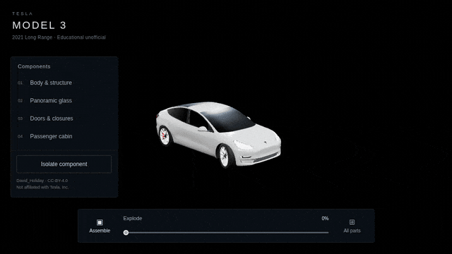 | [explode-assembly](./experiments/explode-assembly/README.md) | [live](https://vibes-explode.vercel.app) | Tesla Model 3 explode / isolate. React + R3F + Three.js. |
| 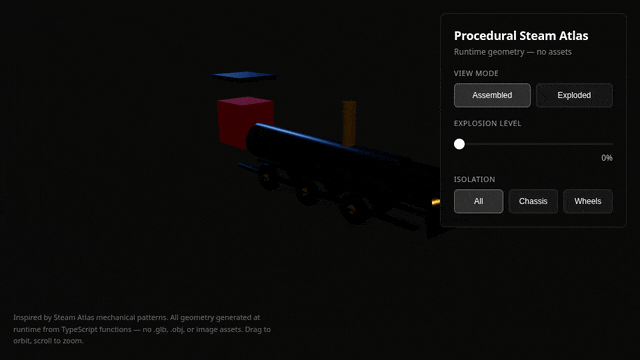 | [procedural-steam-atlas](./experiments/procedural-steam-atlas/README.md) | [live](https://vibes-steam-atlas.vercel.app) | Runtime locomotive from primitives. Vanilla Three.js. No `.glb`. |
| 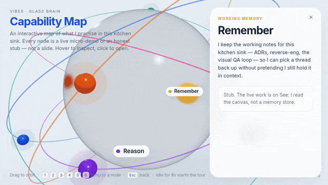 | [glass-capability-brain](./experiments/glass-capability-brain/README.md) | [live](https://vibes-glass-capability-brain.vercel.app) | Frosted capability map with orbiting nodes. React + R3F + drei. |
| 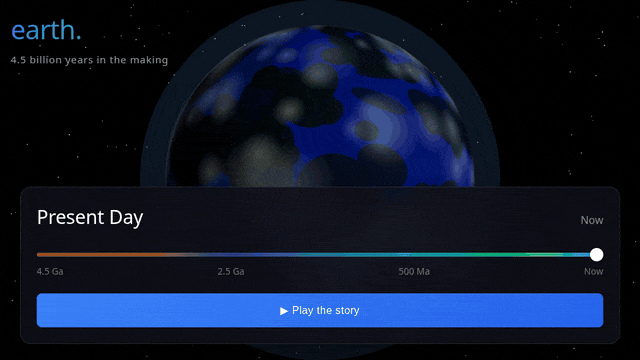 | [earth-timeline](./experiments/earth-timeline/README.md) | [live](https://vibes-earth.vercel.app) | 4.5 billion years on a scrubbable globe. React + R3F + drei. |
| 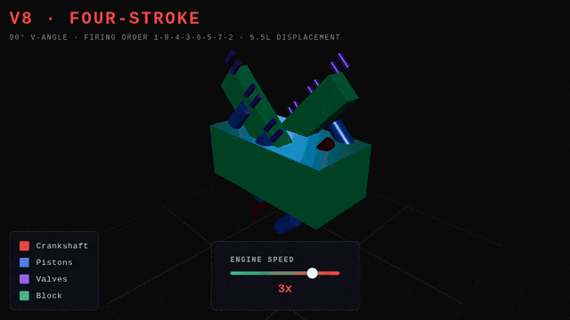 | [v8-cutaway](./experiments/v8-cutaway/README.md) | [live](https://vibes-v8.vercel.app) | 90° V8, pistons, live gauges. React + R3F + drei. |
| 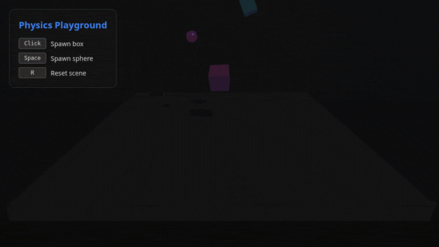 | [web-physics](./experiments/web-physics/README.md) | [live](https://vibes-physics.vercel.app) | Rigid-body playground. Three.js + cannon-es. |
| 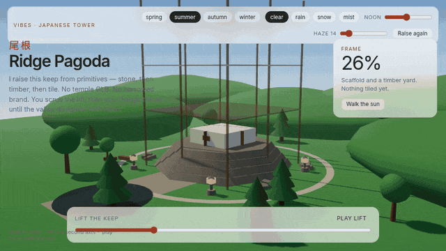 | [japanese-tower](./experiments/japanese-tower/README.md) | [live](https://vibes-japanese-tower.vercel.app) | Procedural Ridge Pagoda with lift + season. React + R3F + drei. |
| 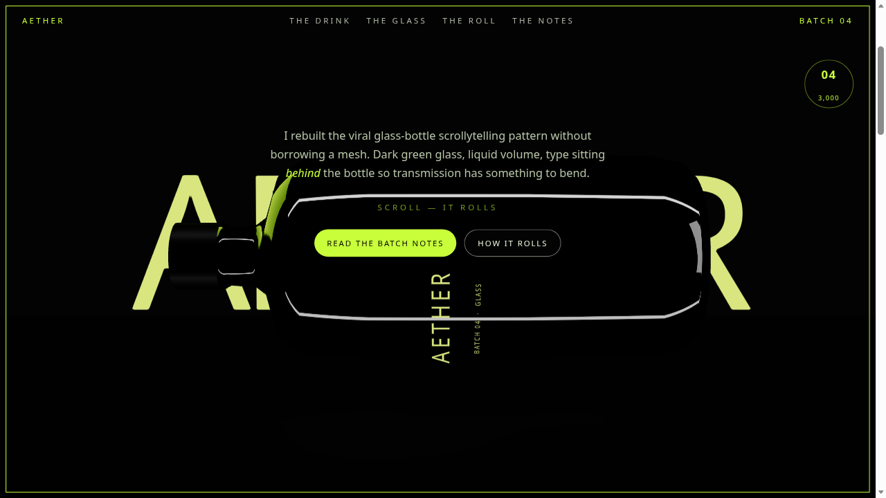 | [scroll-product-showcase](./experiments/scroll-product-showcase/README.md) | — | Scroll-driven glass bottle hero. React + R3F + drei. |
| 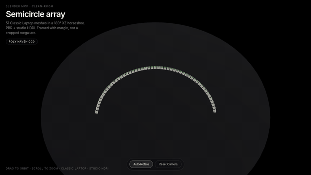 | [blender-semicircle-viewer](./experiments/blender-semicircle-viewer/README.md) | [live](https://vibes-blender-semicircle.vercel.app) | 51 procedural laptops in a 180° arc. Vanilla Three.js. |
| 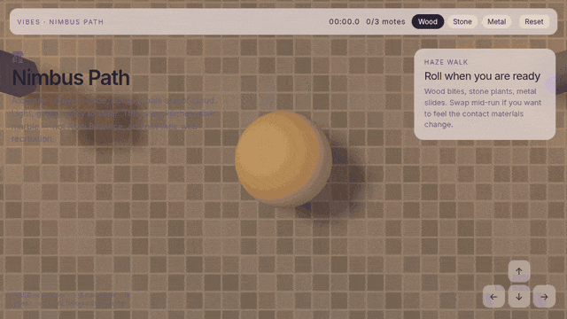 | [ballance-roll](./experiments/ballance-roll/README.md) | — | Nimbus Path marble above clouds. React + R3F + cannon-es. |
| 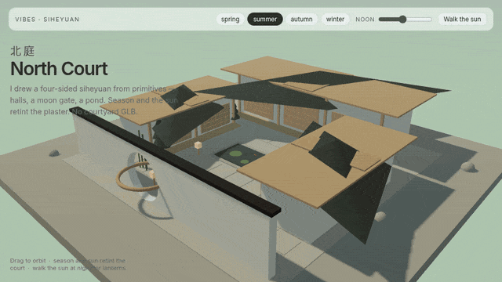 | [chinese-courtyard](./experiments/chinese-courtyard/README.md) | — | North Court siheyuan, season and sun. React + R3F + drei. |
| 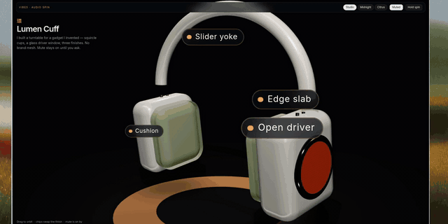 | [audio-gadget-spin](./experiments/audio-gadget-spin/README.md) | — | Lumen Cuff studio turntable. Licensed over-ear GLB. Mute-default Web Audio. |
| 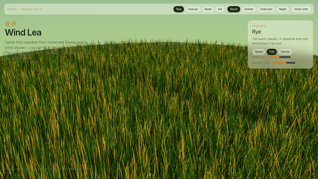 | [procedural-grass-field](./experiments/procedural-grass-field/README.md) | — | Wind Lea meadow. Instanced blades, wind shader. React + R3F + drei. |
| 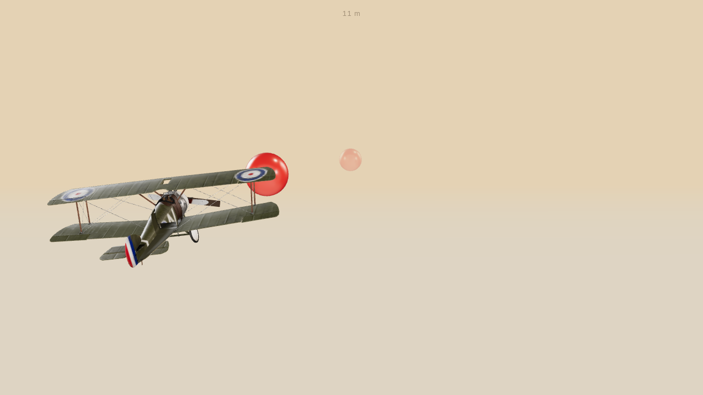 | [amber-longeron](./experiments/amber-longeron/README.md) | — | Amber Longeron lane-dodge. Licensed vintage biplane, tan studio, carnelian orbs. |
| 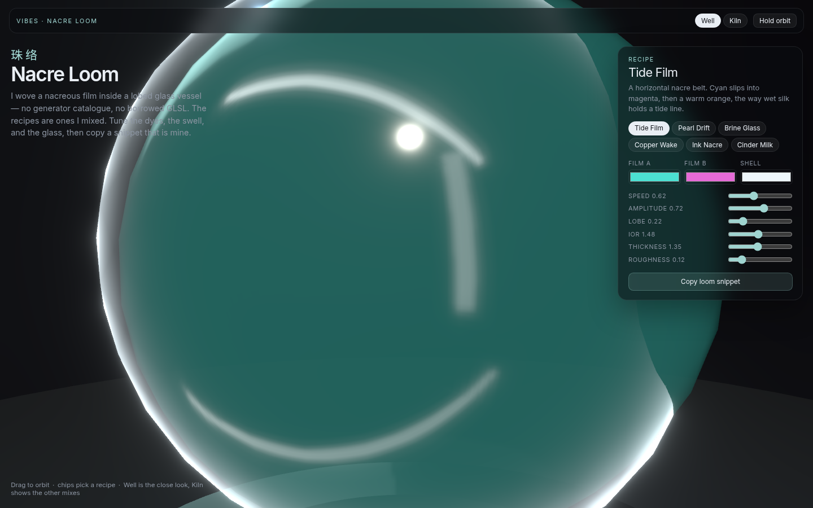 | [nacre-loom](./experiments/nacre-loom/README.md) | — | Nacre Loom glass vessel. Lobed shell, thin-film weave, copyable snippet. React + R3F + drei. |
| 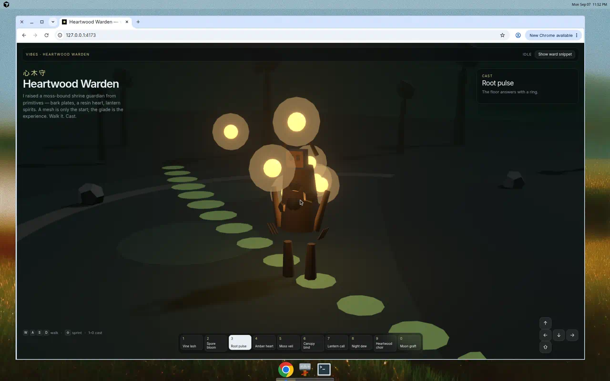 | [heartwood-warden](./experiments/heartwood-warden/README.md) | — | Heartwood Warden woodland. Procedural guardian, Kenney CC0 forest kitbash, invented casts. |
| 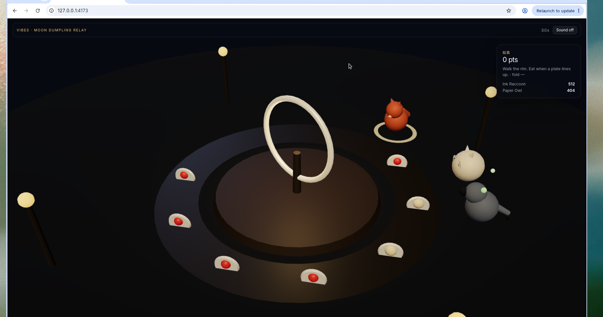 | [moon-dumpling-relay](./experiments/moon-dumpling-relay/README.md) | — | Moon Dumpling Relay. Fox / raccoon / owl diners, spinning moon-gate, chili / tea-leaf. Local-only. React + R3F + drei. |
| 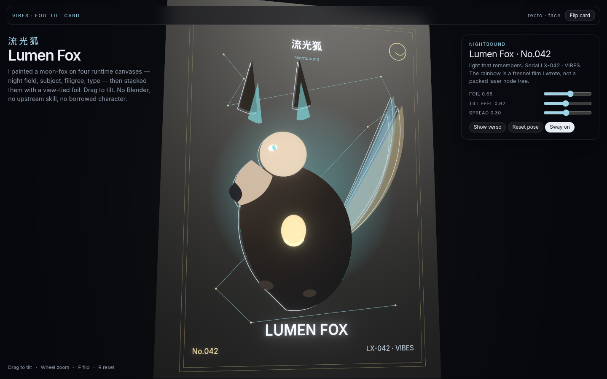 | [foil-tilt-card](./experiments/foil-tilt-card/README.md) | — | Foil Tilt Card. Lumen Fox No.042, layered print, view-tied foil. Local-only. React + R3F + drei. |

Clips are short local loops from each Vite demo. The scroll bottle, Wind Lea, Amber Longeron, Nacre Loom, Heartwood Warden, Moon Dumpling Relay, and Foil Tilt Card are stills until I can loop the glass, the wind, the flight, the film, the glade, the conveyor, and the foil.

**Also in the repo:** [ai-3d-lanes](./experiments/ai-3d-lanes/README.md) (web-3d / blender / cad / mesh-gen) · [image-to-3d](./experiments/image-to-3d/README.md) · [ai-image-texture](./experiments/ai-image-texture/README.md) · [llm-openscad](./experiments/llm-openscad/README.md)

## Quick start

One demo, from a clone:

```bash
git clone https://github.com/johnnyhuy/vibes.git
cd vibes/experiments/explode-assembly
npm install
npm run dev
```

Open the Vite URL (usually `http://localhost:5173`). Same `npm install && npm run dev` pattern in every experiment folder.

## Docs

- [docs/](./docs/) — ADRs, reverse-engineering notes, incidents
- [Deployment notes](./docs/deployment/) — Vercel projects and Root Directory
- [Visual quality bar](./docs/visual-quality-bar.md)

## Disclaimer

**Research and education only.** Rough, incomplete, or whimsical. Not production.

## Licence

MIT — see [LICENSE](./LICENSE). Third-party meshes stay under their own licences: David_Holiday Model 3 (CC-BY) in explode-assembly, bradacvojtech Sopwith Camel (CC-BY) in amber-longeron, Spacebar Headphones (CC-BY) in audio-gadget-spin, Kenney Nature Kit (CC0) in heartwood-warden. Credits live in each experiment’s `ATTRIBUTION.md`.
